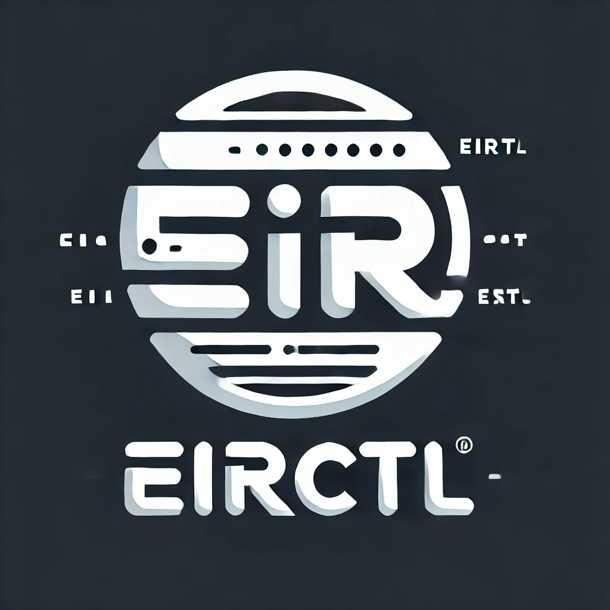
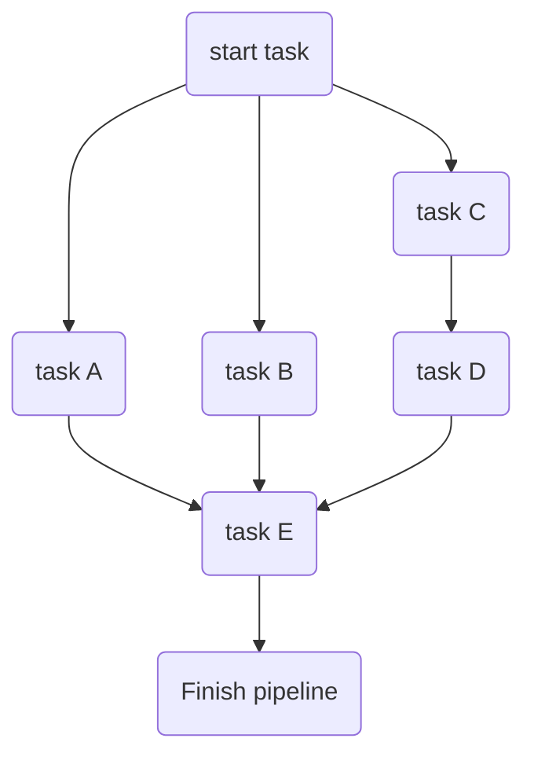

# eirctl - concurrent task and container runner

[](https://pkg.go.dev/github.com/Ensono/eirctl)
[](https://goreportcard.com/report/github.com/Ensono/eirctl)

[](https://sonarcloud.io/summary/new_code?id=Ensono_eirctl)
[](https://sonarcloud.io/summary/new_code?id=Ensono_eirctl)
[](https://sonarcloud.io/summary/new_code?id=Ensono_eirctl)
[](https://sonarcloud.io/summary/new_code?id=Ensono_eirctl)
[](https://sonarcloud.io/summary/new_code?id=Ensono_eirctl)
[](https://sonarcloud.io/summary/new_code?id=Ensono_eirctl)

EirCtl is a build tool alternative to GNU Make, as with some of the others like it's inspiration [taskctl]() and taskfile and others it is cross platform so works on windows.
> As with most things windows, this comes with a few caveats

Whilst it is built within the Ensono ecosystem and is used within the Ensono Independent Runner and Ensono Stacks, **it can and is used in isolation**.

## Configuration

The configuration is driven through YAML which has its [schema](https://raw.githubusercontent.com/Ensono/eirctl/refs/heads/main/schemas/schema_v1.json) published and maintained. For an easier developer experience it can integrated into your IDE.

Key concepts, see below for more details.

- [task](#tasks) => jobs
- [contexts](#contexts)
- [pipelines](#pipelines)

Additional concepts:

- execution graphs can be seen [here in more detail.](./docs/graph-implementation.md)
- native container support [here](#docker-context)

### CLI

The CLI offers a range of commands, each of them needs a valid config file.

- `completion`
  
  Generate the autocompletion script for the specified shell
- `generate`
  
  Generates a CI definition in a target implementation from a Eirctl pipeline definition.

- `graph`
  
  Visualizes pipeline execution graph
- `help`
  
  Help about any command
- `init`
  
  Initializes the directory with a- sample config file

- `list`
  
  Lists contexts, pipelines, tasks- and watchers

- `run`

  Runs a pipeline or a task, see `eirctl run -h` for more options.
  > :info: eirctl <pipeline|task> will behave as `eirctl run pipeline|task`

- `shell [beta]`
  
  Shell into the supplied container-context, works only with the native container context

- `show`
  
  Shows task's details

- `validate`
  
  Validates config file

- `watch`
  
  Watches changes in directories to perform certain tasks [WATCHERS...]

## Tasks

### Tasks variables

Each task, stage and context has variables to be used to render task's fields  - `command`, `dir`.
Along with globally predefined, variables can be set in a task's definition.
You can use those variables according to `text/template` [documentation](https://golang.org/pkg/text/template/).

Predefined variables are:
- `.Root` - root config file directory
- `.Dir` - config file directory
- `.TempDir` - system's temporary directory
- `.Args` - provided arguments as a string
- `.ArgsList` - array of provided arguments
- `.Task.Name` - current task's name
- `.Context.Name` - current task's execution context's name
- `.Stage.Name` - current stage's name
- `.Output` - previous command's output
- `.Tasks.Task1.Output` - `task1` last command output

### Pass CLI arguments to task

Any command line arguments succeeding `--` are passed to each task via `.Args`, `.ArgsList` variables or `ARGS` environment variable.

Given this definition:
```yaml
lint1:
  command: go lint {{.Args}}

lint2:
  command: go lint {{index .ArgsList 1}}
```

the resulting command is:

```
$ eirctl lint1 -- package.go
# go lint package.go

$ eirctl lint2 -- package.go main.go
# go lint main.go
```

### Storing task's output

[PLACEHOLDER]

### Tasks variations

Task may run in one or more variations. Variations allows to reuse task with different env variables:

```yaml
tasks:
  build:
    command:
      - GOOS=${GOOS} GOARCH=amd64 go build -o bin/eirctl_${GOOS} ./cmd/eirctl
    env:
      GOFLAGS: -ldflags=-s -ldflags=-w
    reset_context: true
    variations:
      - GOOS: linux
      - GOOS: darwin
      - GOOS: windows
```

this config will run build 3 times with different GOOS

### Task conditional execution

The following task will run only when there are any changes that are staged but not committed:
```yaml
tasks:
  build:
    command:
      - ...build...
    condition: git diff --exit-code
```

## Pipelines

Pipeline is a set of stages (tasks or other pipelines) to be executed in a certain order. Stages may be executed in parallel or one-by-one. 
Stage may override task's environment, variables etc. 

This pipeline:
```yaml
pipelines:
    pipeline1:
        - task: start task
        - task: task A
          depends_on: "start task"
        - task: task B
          depends_on: "start task"
        - task: task C
          depends_on: "start task"
        - task: task D
          depends_on: "task C"
        - task: task E
          depends_on: ["task A", "task B", "task D"]
        - task: finish
          depends_on: ["task E"]    
```

will result in an execution plan like this:



Stage definition takes following parameters:

- `name` - stage name. If not set - referenced task or pipeline name will be used.
- `task` - task to execute on this stage
- `pipeline` - pipeline to execute on this stage
- `env` - environment variables. All existing environment variables will be passed automatically
- `depends_on` - name of stage on which this stage depends on. This stage will be started only after referenced stage is completed.
- `allow_failure` - if `true` failing stage will not interrupt pipeline execution. ``false`` by default
- `condition` - condition to check before running stage
- `variables` - stage's variables

## output formats

eirctl has several output formats:

- `raw` - prints raw commands output
- `prefixed` - strips ANSI escape sequences where possible, prefixes command output with task's name
- `cockpit` - tasks dashboard

## Contexts

Contexts allow you to set up execution environment, variables, binary which will run your task, up/down commands etc.

The context has the lowest precedence in environment variable setting - i.e. it will be overwritten by pipeline > task level variables - [more info here](./docs/graph-implementation.md#environment-variables).

```yaml
contexts:
  zsh:
    executable:
      bin: /bin/zsh
      args:
        - -c
    env:
      VAR_NAME: VAR_VALUE
    variables:
      sleep: 10
    quote: "'" # will quote command with provided symbol: "/bin/zsh -c 'echo 1'"
    before: echo "I'm local context!"
    after: echo "Have a nice day!"
```

Context has hooks which may be triggered once before first context usage or every time before task with this context will run.

```yaml
context:
  docker-compose:
    executable:
      bin: docker-compose
      args: ["exec", "api"]
    up: docker-compose up -d api
    down: docker-compose down api
  local:
    after: rm -rf var/*
```

### Docker context

It uses the native Go API for OCI compliant docker runtimes (docker, podman, containerd, etc...).

> This means you don't need the docker cli installed

```yaml
  alpine:
    executable:
      bin: /usr/local/bin/docker
      args:
        - run
        - --rm
        - alpine:latest
    env:
      DOCKER_HOST: "tcp://0.0.0.0:2375"
    before: echo "SOME COMMAND TO RUN BEFORE TASK"
    after: echo "SOME COMMAND TO RUN WHEN TASK FINISHED SUCCESSFULLY"

tasks:
  mysql-task:
    context: alpine
    command: uname -a
```

Being able to pass environment variables to a Docker container is crucial for many build scenarios.

## Go API

[PLACEHOLDER]

## How to contribute?

Feel free to contribute in any way you want. Share ideas, submit issues, create pull requests. 
You can start by improving this [README.md](https://github.com/Ensono/eirctl/blob/master/README.md) or suggesting new [features](https://github.com/Ensono/eirctl/issues)
Thank you!

## License

This project is licensed under the GNU GPLv3 - see the [LICENSE.md](LICENSE.md) file for details

## Acknowlegdments

The [original inspiration](https://github.com/taskctl/taskctl) for this project.

> As it is still using parts of the original code, this project is also under the GPLv3
