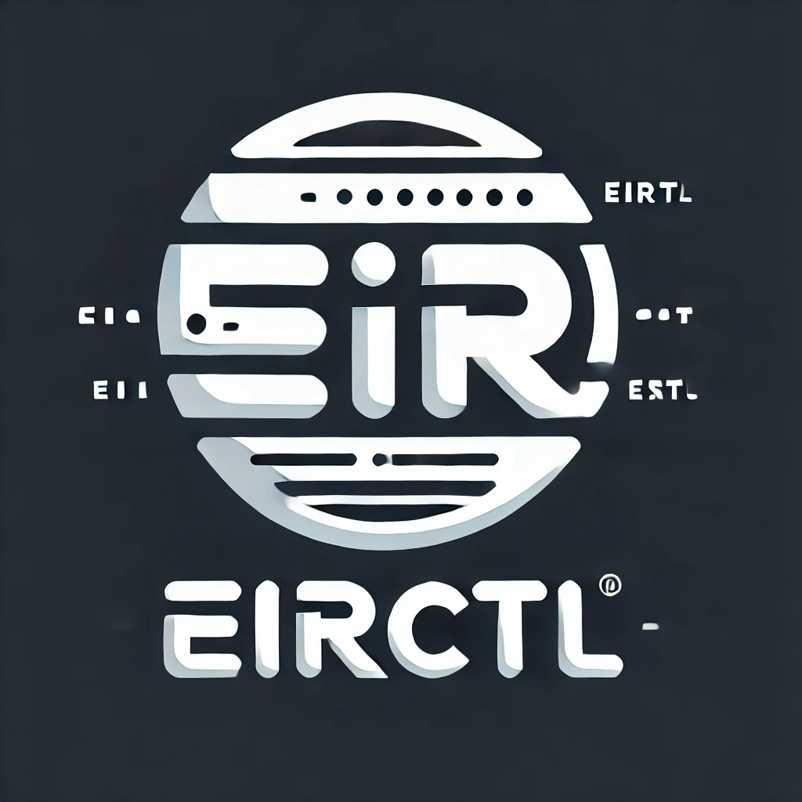
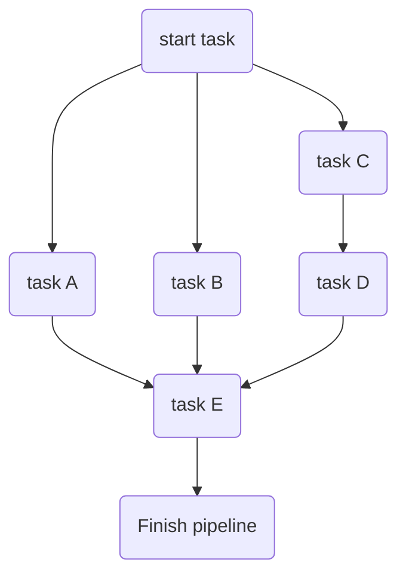

# eirctl - concurrent task and container runner



[](https://pkg.go.dev/github.com/Ensono/eirctl)
[](https://goreportcard.com/report/github.com/Ensono/eirctl)

[](https://sonarcloud.io/summary/new_code?id=Ensono_eirctl)
[](https://sonarcloud.io/summary/new_code?id=Ensono_eirctl)
[](https://sonarcloud.io/summary/new_code?id=Ensono_eirctl)
[](https://sonarcloud.io/summary/new_code?id=Ensono_eirctl)
[](https://sonarcloud.io/summary/new_code?id=Ensono_eirctl)
[](https://sonarcloud.io/summary/new_code?id=Ensono_eirctl)

`eirctl` is a build tool alternative to GNU Make, like it's inspiration [taskctl](https://github.com/taskctl/taskctl), taskfile and others it is cross-platform and cross-architecture, so it works on Windows, Linux and MacOS on either `amd64` or `arm64`, as the Go source code is provided it can be compiled for any architecture supported by the language and the project dependencies.

> [!NOTE]
> As with most things Windows, this comes with a few caveats:
>
> - use of a modern shell (i.e. Powershell 5+)
> - use of a terminal emulator supporting modern constructs (i.e. Windows Terminal)
> - ensure that the correct line endings are in use, use git's `autocrlf` if necessary

Whilst it is built within the Ensono ecosystem and is used within the Ensono Independent Runner and Ensono Stacks, **it can and is used in isolation**.

## [Installation](./docs/installation.md)

## Configuration

The configuration is driven through YAML which has its [schema](https://raw.githubusercontent.com/Ensono/eirctl/refs/heads/main/schemas/schema_v1.json) published and maintained. For an easier developer experience it can integrated into your IDE.

Key concepts, see below for more details.

- [task](#tasks) → defines a series of commands and their possible variations which compile down to a job
- [contexts](#contexts)
- [pipelines](#pipelines)
- [imports](./docs/import.md)

Additional concepts:

- [execution graphs](./docs/graph-implementation.md)
- [native container support](#docker-context)

### CLI

The CLI offers a range of commands, most of them needs a valid config file.

> [!NOTE]
> `eirctl <pipeline|task>` will behave as `eirctl run pipeline|task`

- `completion`: Generate the autocompletion script for the specified shell (`bash`, `fish`, `powershell` or `zsh`).
- `generate`: Generates a CI definition in a target implementation from a `eirctl` pipeline definition.
- `graph`: Visualizes pipeline execution graph.
- `init`: Initializes the directory with a sample config file.
- `list`: Lists contexts, pipelines, tasks and watchers.
- `run`: Runs a pipeline or a task, see `eirctl run -h` for more options.
- `shell`: Shell into the supplied container-context, works only with the native container context. (Beta Feature)
- `show`: Shows task's details.
- `validate` Validates config file.
- `watch`: Watches changes in directories to perform certain tasks (see [watchers](docs/watchers.md)).

## Tasks

### Tasks variables

Each task, stage and context has variables to be used to render task's fields - `command`, `dir`.
Along with globally predefined, variables can be set in a task's definition.
You can use those variables according to `text/template` [documentation](https://pkg.go.dev/text/template).

Predefined variables are:

- `.Root` - root config file directory
- `.Dir` - config file directory
- `.TempDir` - system's temporary directory
- `.Args` - provided arguments as a string - useful in assigning additional caller defined args to binaries inside a task
- `.ArgsList` - array of provided arguments - useful for templating
- `.Task.Name` - current task's name
- `.Context.Name` - current task's execution context's name
- `.Stage.Name` - current stage's name

User supplied vars i.e. using the `--set Var1=value` will all be merged and are available for templating and Required checking

### Pass CLI arguments to task

Any command line arguments succeeding `--` are passed to each task via `.Args`, `.ArgsList` variables or `ARGS` environment variable.

Given this definition:

```yaml
lint1:
  command: go lint {{.Args}}

lint2:
  command: go lint {{index .ArgsList 1}}
```

the resulting command is:

```sh
$ eirctl lint1 -- package.go
# go lint package.go

$ eirctl lint2 -- package.go main.go
# go lint main.go
```

### Required Input

The required input is a map of either `Variables` or `Env` (Environment variables).

The computational check happens at runtime and not compile time - currently - this is to allow for any dynamically set variables throughout the pipeline's execution to be taken into account.

This comes with potential delay of catching of issues, the current implementation will collect all errors before returning to avoid back and forth.

> [!IMPORTANT]
> Potentially some aspects of this could be moved to the validate subcommand.

```yaml
task:requiredVar:
  command: echo "var has been set {{ .SetMe }} and required env ${REQUIRED_ENV}"
  required:
    env: [REQUIRED_ENV]
    vars:
      - SetMe
```

`REQUIRED_ENV=isSet eirctl run task task:requiredVar --set SetMe=thats-right`

> [!TIP]
> When running this task in an eirctl pipeline, `REQUIRED_ENV` can be set in a previous task, in global env, in an envfile, via a direct assignment the parent pipeline(s).

### Storing task's output

For more information about storing the task output and picking it up by another task see the [artifacts](./docs/artifacts.md) for more details.

> [!NOTE]
> Future iteration should include a custom remote backend like S3, GCS, etc...

### Tasks variations

Task may run in one or more variations. Variations allows to reuse task with different env variables:

```yaml
tasks:
  build:
    command:
      - GOOS=${GOOS} GOARCH=amd64 go build -o bin/eirctl_${GOOS} ./cmd/eirctl
    env:
      GOFLAGS: -ldflags=-s -ldflags=-w
    reset_context: true
    variations:
      - GOOS: linux
      - GOOS: darwin
      - GOOS: windows
```

this config will run build 3 times with different GOOS

### Task conditional execution

The following task will run only when there are any changes that are staged but not committed:

```yaml
tasks:
  build:
    command:
      - ...build...
    condition: git diff --exit-code
```

## Pipelines

Pipeline is a set of stages (tasks or other pipelines) to be executed in a certain order. Stages may be executed in parallel or one-by-one.
Stage may override task's environment, variables etc.

This pipeline:

```yaml
pipelines:
    pipeline1:
        - task: start task
        - task: task A
          depends_on: "start task"
        - task: task B
          depends_on: "start task"
        - task: task C
          depends_on: "start task"
        - task: task D
          depends_on: "task C"
        - task: task E
          depends_on: ["task A", "task B", "task D"]
        - task: finish
          depends_on: ["task E"]    
```

will result in an execution plan like this:



Stage definition takes following parameters:

- `name` - stage name. If not set - referenced task or pipeline name will be used.
- `task` - task to execute on this stage
- `pipeline` - pipeline to execute on this stage
- `env` - environment variables. All existing environment variables will be passed automatically
- `depends_on` - name of stage on which this stage depends on. This stage will be started only after referenced stage is completed.
- `allow_failure` - if `true` failing stage will not interrupt pipeline execution. ``false`` by default
- `condition` - condition to check before running stage
- `variables` - stage's variables

## Output formats

eirctl has several output formats:

- `raw` - prints raw commands output
- `prefixed` - strips ANSI escape sequences where possible, prefixes command output with task's name
- `cockpit` - tasks dashboard

## Contexts

Contexts allow you to set up execution environment, variables, binary which will run your task, up/down commands etc.

The context has the lowest precedence in environment variable setting - i.e. it will be overwritten by pipeline → task level variables - [more info here](./docs/graph-implementation.md#environment-variables).

> [!NOTE]
> _envfile_ property on the context allows for further customization of the injected environment.
> It can merge env from a file or mutate/include/exclude existing environment - see the [schema](./schemas/schema_v1.json) for more details

_Tasks running without a context_ will be run in a [cross platform shell](https://github.com/mvdan/sh). You can follow any issues on the project site with GNU tool conversion of host->mvdan emulator shell mapping.

```yaml
tasks:
  runs:mvdan:sh:
    command: echo "in emulated cross platform shell"

contexts:
  zsh:
    executable:
      bin: /bin/zsh
      args:
        - -c
    env:
      VAR_NAME: VAR_VALUE
    variables:
      sleep: 10
    quote: "'" # will quote command with provided symbol: "/bin/zsh -c 'echo 1'"
    before: echo "I'm local context!"
    after: echo "Have a nice day!"
```

Context has hooks which may be triggered once before first context usage or every time before task with this context will run.

> NB: context before/after tasks run outside of the context itself and are always executed in the mvdan shell.

```yaml
context:
  docker-compose:
    executable:
      bin: docker-compose
      args: ["exec", "api"]
    up: docker-compose up -d api
    down: docker-compose down api
```

### Docker context

It uses the native Go API for OCI compliant runtimes (docker, podman, containerd, etc...) and offers further enhancements like the command [shell](#cli).

> [!IMPORTANT]
> This means you don't need the docker cli installed

There are however _three_ ways of achieving the same thing

```yaml
contexts:
  new:container:
    container:
      name: alpine:latest
      enable_dind: false
      container_args:
        - -u 1000:1000
        - -v $HOME/foo:/foo
        - -v ~/bar:/bar
        - -p 10000:80
      shell: sh
      shell_args:
        - -c

  # the executable property will not be removed
  # as it's handy for a lot of other use cases - see above
  # 
  # It will however remove all the env-file injection and so on
  old:container:
    executable:
      bin: docker
      args:
        - run
        - --rm
        - -v $PWD:/app
        - -w /app 
        - alpine:latest
        - sh
        - -c

tasks:
  run:docker:mvdan: 
    command:
      - docker run --rm -v $PWD:/app -w /app alpine:latest sh -c "pwd && ls -lat ."
  
  run:container:new: 
    context: new:container
    command:
      - pwd
      - ls -lat .

  run:container:old: 
    context: old:container
    command:
      - pwd
      - ls -lat .
```

Whilst they are all valid to achieve a similar outcome, each depends on the use case.

### some downsides of the `old:container` context

- The lack of changing env injection with the `old:container` context, it does not support variations properly on the task as it pre-creates a set of environment variables.

- Using the CLI directly limits can be hit with the number of env variables you can inject in.

> [!NOTE]
> if using private registries and are running in an environment where a separate docker config file is generated - e.g. in CI where there is no access to HOME or similar

- set an `REGISTRY_AUTH_FILE` env variable to point to the registry auth and other docker config settings

## Go API

_Currently_ this project only supports a pre-built binary for a complete flow, however you can see the tests and examples for some useful flows.

The runner package:

- [Executor Container's](runner/executor_container.go) public API, specifically the `Execute` method is a potentially useful single shot execution.

- [TaskRunner](runner/runner.go)'s `Run` method is a useful scheduling flow where multiple tasks need coordinating.

## How to contribute?

Feel free to contribute in any way you want. Share ideas, submit issues, create pull requests.
You can start by improving this [README.md](https://github.com/Ensono/eirctl/blob/master/README.md) or suggesting new [features](https://github.com/Ensono/eirctl/issues)
Thank you!

## License

This project is licensed under the GNU GPLv3 - see the [LICENSE](LICENSE) file for details

## Acknowledgments

The [original inspiration](https://github.com/taskctl/taskctl) for this project.

> [!IMPORTANT]
> As it is still using parts of the original code, this project is also under the GPLv3
