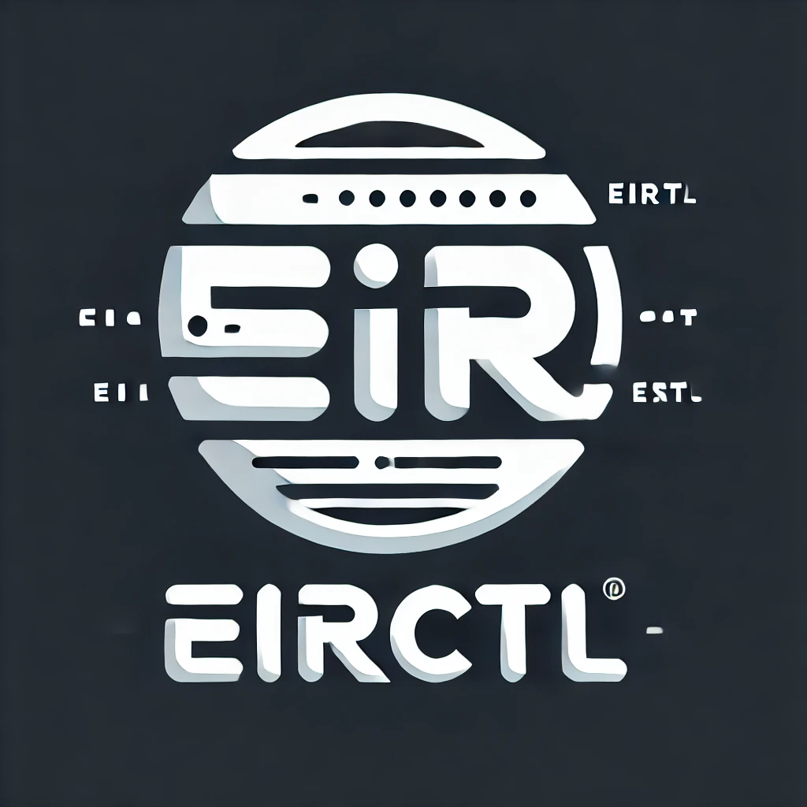

= eirctl Documentation
:toc: left
:toclevels: 3
:icons: font
:source-highlighter: highlight.js

== Overview

eirctl is a cross-platform concurrent task and container runner - a build tool alternative to GNU Make. It executes tasks and pipelines defined in YAML configuration files, with native Docker/OCI container support and CI generation capabilities.

=== Key Features

* **Cross-platform**: Works on Windows, Linux, and macOS (amd64/arm64)
* **Native container support**: Uses Docker/OCI API directly - no CLI required
* **Pipeline orchestration**: Define complex execution graphs with dependencies
* **CI generation**: Convert pipelines to GitHub Actions, GitLab CI, Bitbucket Pipelines
* **Variable templating**: Powerful Go template support for dynamic configuration
* **File watchers**: Trigger tasks on filesystem changes

== Quick Start

. Install eirctl (see xref:installation.adoc[Installation Guide])
. Create an `eirctl.yaml` configuration file
. Run `eirctl run <pipeline|task>` or just `eirctl` for interactive mode

[source,yaml]
----
# Example eirctl.yaml
tasks:
  hello:
    command: echo "Hello from eirctl!"
    
  build:
    command: go build -o bin/app ./cmd/main.go

pipelines:
  ci:
    - task: hello
    - task: build
      depends_on: hello
----

== Documentation Index

=== Getting Started

* xref:installation.adoc[Installation] - Download and install eirctl
* xref:cli-reference.adoc[CLI Reference] - Complete command reference
* xref:migration.adoc[Migration Guide] - Upgrading from taskctl or previous versions

=== Core Concepts

* xref:tasks.adoc[Tasks] - Define commands, variations, and conditions
* xref:pipelines.adoc[Pipelines] - Orchestrate task execution with dependencies
* xref:contexts.adoc[Contexts] - Configure execution environments
* xref:variables.adoc[Variables] - Templating and environment configuration

=== Configuration

* xref:import.adoc[Imports] - Share configurations across projects
* xref:envfile.adoc[Envfile] - Environment file configuration
* xref:artifacts.adoc[Artifacts] - Store and share task outputs
* xref:watchers.adoc[Watchers] - Trigger tasks on file changes

=== Advanced Topics

* xref:ci-generator.adoc[CI Generator] - Generate CI/CD pipeline definitions
* xref:graph-implementation.adoc[Graph Internals] - Execution graph details

== Sample Files

The following sample configurations are available in the `samples/` directory:

* link:samples/example.yaml[example.yaml] - Comprehensive example configuration
* link:samples/docker-compose.yaml[docker-compose.yaml] - Docker Compose integration example
* link:samples/pipelines/pipeline.yaml[pipeline.yaml] - Pipeline configuration example
* link:samples/contexts/docker.build.yaml[docker.build.yaml] - Container context examples
* link:samples/ci/[CI samples] - Generated CI workflow examples

== Schema

The configuration schema is available at:

https://raw.githubusercontent.com/Ensono/eirctl/refs/heads/main/schemas/schema_v1.json

Add this to your YAML files for IDE support:

[source,yaml]
----
# yaml-language-server: $schema=https://raw.githubusercontent.com/Ensono/eirctl/refs/heads/main/schemas/schema_v1.json
----

== Contributing

Contributions are welcome! See the https://github.com/Ensono/eirctl[GitHub repository] for:

* Issue reporting
* Pull requests
* Feature discussions

== License

This project is licensed under the GNU GPLv3. See the https://github.com/Ensono/eirctl/blob/main/LICENSE[LICENSE] file for details.
