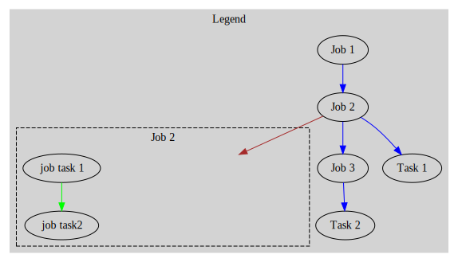
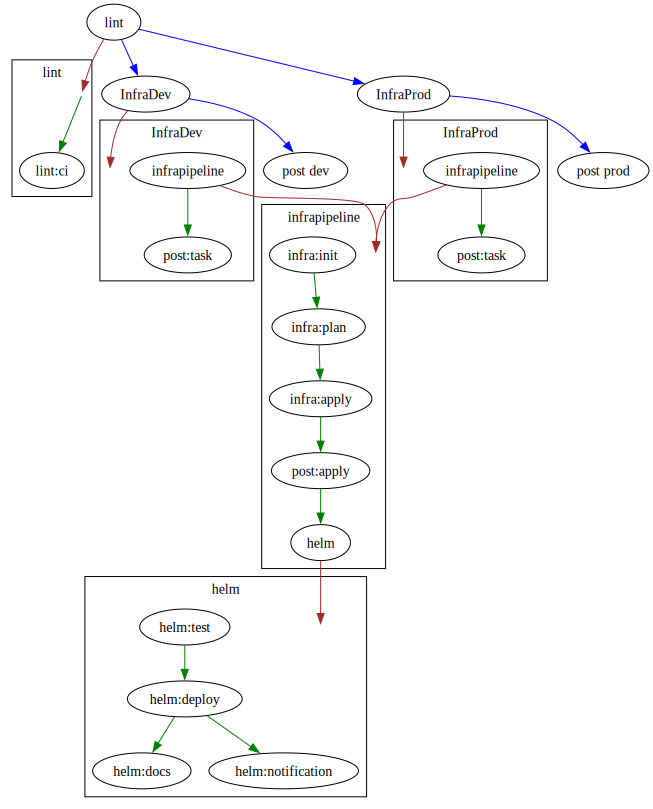
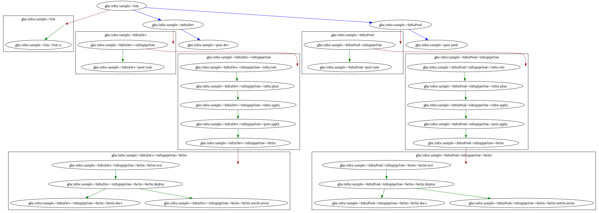

= Graph Internals
:toc:
:toclevels: 2

The internal processes generate, essentially, an n-ary tree. The tree may have nodes which themselves are other trees.

IMPORTANT: There are never any edges between nodes in a child tree to the parent tree. Only single level stages (nodes) can `depends_on` each other.

== Graph Legend

The generated graphs use the following legend. It can also be embedded in the generated digraph by specifying the `--legend` flag.

* *Blue arrows* are the first level stages in the pipeline - these can be direct tasks or other pipelines
* *Brown arrows* denote a job that is a pipeline itself and points to the subgraph that represents that pipeline
* *Green arrows* point from stage to stage (stage can be a task or a pipeline) in any subgraphs

== Normalized vs Denormalized

Both graph types are useful for different reasons.

=== Purpose

[cols="1,3",options="header"]
|===
| Graph Type | Purpose

| Normalized
| Aids in understanding visually how execution will happen and highlighting any reusable components (tasks or pipelines)

| Denormalized
| Generated for the actual scheduled run - each instance of a step and all its parents are unique even if they come from shared steps, ensuring each path of the tree has a unique path

|===

=== Normalized

The generated tree can be viewed in normalized form using the graph command:

[source,bash]
----
eirctl graph gha:infra:sample -c ./cmd/eirctl/testdata/gha.sample.yml | dot -Tsvg -o normalized.svg
----

=== Denormalized

When running the run command with `--graph-only`, it generates the denormalized tree graph:

[source,bash]
----
eirctl run gha:infra:sample -c ./cmd/eirctl/testdata/gha.sample.yml --graph-only | dot -Tsvg -o denormalized.svg
----

== Environment Variables

With denormalization performed for each `run` command, hierarchical environment variable manipulation is possible. Injected environment variables can now be inherited from the parent.

=== Inheritance

The general flow of inheritance is from the more general to the more specific:

----
Context < Pipeline < Task
----

NOTE: Presence of a file named `eirctl.env` (must follow nix-style env file syntax `KEY=value`) will automatically make this part of the context environment variable. It follows the same precedence as above.

TIP: `envfile` can specify path(s) to custom `.env` files - which now support in-file references to variables. It does _not_ support more advanced envsubst-style defaults and empty checkers.

NOTE: Multiple `envfile.path[]` can be specified on any level with the following order of precedence: `context < task < stage (task called from a pipeline)`

As the file is scanned line by line, any referenced vars need to be specified after their declaration:

[source,env]
----
FOO=bar
QUX=$FOO
BAZ=${FOO}
----

Anything set at the context level will always be injected into the pipeline and task, unless the same key is set in the pipeline (in which case it will be overwritten). Anything set in a task will overwrite previously set env keys.

=== Precedence Example

The tree is walked backwards to the first ancestor, meaning a task or pipeline can have multiple levels of env keys set. Consider this `tester` pipeline:

[source,yaml]
----
pipelines:
  wrapped: 
    - task: task:three
    - task: task:four
      depends_on:
        - task:three
      env: 
        FOO: task-set-val-always-wins

  action:one:
    - task: task:five
    - name: do-this
      pipeline: wrapped
      env:
        SOME: set-level-1
        OTHER: this-do
      depends_on:
        - task:five

  action:two:
    - task: task:five
    - name: do-that
      pipeline: wrapped
      depends_on:
        - task:five

  tester:
    - task: task:one
    - task: task:two
      depends_on:
        - task:one
    - pipeline: action:one
      depends_on:
        - task:one
      env:
        SOME: this
    - pipeline: action:two
      depends_on:
        - task:one
      env:
        SOME: that
----

The path to `task:four` can be achieved in the following ways:

==== Path 1: tester → action:one → do-this → task:four

* `action:one` is a pipeline that has a child `do-this` which is another pipeline (an alias to the `wrapped` pipeline which contains `task:four`)
* `task:four` will have these values:
** `FOO: task-set-val-always-wins`
** `SOME: set-level-1`
** `OTHER: this-do`
* `SOME` would be overwritten inside the `action:one` → `do-this` pipeline

==== Path 2: tester → action:two → do-that → task:four

* `action:two` is a pipeline that has a child `do-that` which is another pipeline (an alias to the `wrapped` pipeline which contains `task:four`)
* `task:four` will have these values:
** `FOO: task-set-val-always-wins`
** `SOME: that`
* `SOME` would be inherited from the `tester` referenced `action:two` pipeline

WARNING: The `env` property specified directly on a task will have the highest precedence.
